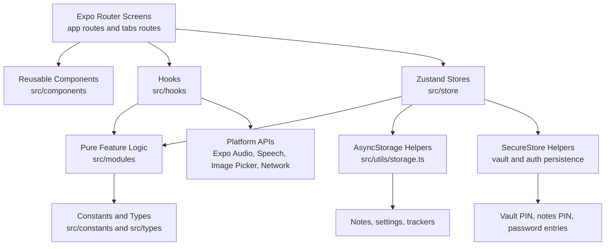

# UTILZ

UTILZ is a smart utility toolkit built with Expo, React Native, and Expo Router. It combines everyday utility workflows into one mobile experience: calculator, multi-category converters, time tools, health trackers, protected notes, a lightweight password vault, and app-level personalization.

The project was structured to score well on architecture as much as functionality, so the codebase separates screens, reusable UI, hooks, stores, pure business logic, and utility helpers. The current build also includes adaptive theming, an animated entry flow, safe-area-aware layouts, and keyboard-aware forms for the screens that collect input.

## What Has Been Implemented

### Core app shell
- Expo Router file-based navigation with a root stack and bottom tab navigator
- Native splash configuration plus a custom animated entry screen handoff
- Inter font loading at app startup
- Automatic light/dark theme support based on the device setting
- In-app theme override support from Settings
- In-app font preference switching
- Safe-area-aware layouts across the tab shell and deeper feature screens
- Keyboard-aware scrolling on input-heavy pages using `react-native-keyboard-controller`

### Home
- Quick-action dashboard for the app's major sections
- Summary metrics for available tools, saved notes, and calculator history
- Card-based navigation into Converter, Calculator, Time, and More

### Calculator
- Custom calculator UI styled to match the project theme
- Standard arithmetic operations
- Scientific helpers including `sin`, `cos`, `tan`, `log`, `sqrt`, `pi`, `e`, and parentheses
- Result evaluation and reusable expression handling
- Calculation history persisted in Zustand store state

### Converter
- Category-based conversion flow with top-level switching between converter types
- Implemented converter modules for:
  - Length
  - Weight
  - Temperature
  - Area
  - Speed
  - Currency
  - Number base conversion
- Currency conversion powered by the Frankfurter API when online
- Offline currency fallback rates when network is unavailable
- Shared converter logic extracted into pure `src/modules/converter/*` functions

### Time tools
- World clock experience with selectable featured timezone
- 12-hour and 24-hour format switching
- Timezone-to-timezone conversion cards
- Countdown timer with presets
- Stopwatch with laps
- Time formatting and conversion logic extracted into `src/modules/time/worldclock.ts`

### Health
- BMI calculator
- Water intake tracker
- Simple calorie tracker
- Local persistence for health tracker values

### Notes
- Notes list with persistent local storage
- Dedicated note editor screen
- Category tagging for notes
- Text note creation and editing
- Image attachment via Expo Image Picker
- Voice note recording with `expo-audio`
- Speech-to-text dictation with `expo-speech-recognition`
- Notes protection with an optional separate PIN flow

### Password tools
- Password generator with configurable character groups and length
- Generator validation to avoid empty character-pool generation
- Copy-to-clipboard flow for generated passwords
- Password vault list, detail, setup, and unlock flows
- Vault entries store:
  - site/app
  - username/email
  - password
- Dedicated vault PIN that is separate from notes protection
- Locked-session model for the vault with explicit unlock and relock behavior

### Settings
- Theme preference: auto, light, dark
- Font preference switching
- Language preference placeholder flow
- Notes protection toggle and notes PIN management
- Vault access and vault PIN management
- Shortcut into native app settings for permissions review

## Architecture

The app follows a screen -> hook/store -> module -> persistence flow so the UI stays thin and the core logic stays testable.



### Architectural principles used
- `app/` contains route files and screen composition only
- `src/components/` contains reusable visual building blocks
- `src/modules/` contains pure business logic and feature helpers
- `src/hooks/` bridges UI and side effects such as timers, network, and vault/notes protection
- `src/store/` centralizes shared state with Zustand
- `src/utils/` contains persistence, clipboard, and low-level helpers
- `src/constants/` centralizes theme, scale, units, shadows, and app copy

## Project structure

```text
hng-stage-zero/
|-- app/
|   |-- _layout.tsx
|   |-- index.tsx
|   |-- +not-found.tsx
|   |-- (tabs)/
|   |   |-- _layout.tsx
|   |   |-- index.tsx
|   |   |-- calculator.tsx
|   |   |-- converter.tsx
|   |   |-- time.tsx
|   |   `-- more.tsx
|   `-- more/
|       |-- health.tsx
|       |-- notes.tsx
|       |-- note-editor.tsx
|       |-- notes-unlock.tsx
|       |-- tools.tsx
|       |-- password-generator.tsx
|       |-- vault-entry.tsx
|       |-- vault-lock.tsx
|       |-- vault.tsx
|       `-- settings.tsx
|-- src/
|   |-- components/
|   |-- constants/
|   |-- hooks/
|   |-- modules/
|   |-- store/
|   |-- types/
|   `-- utils/
|-- assets/
|-- app.json
|-- eas.json
|-- package.json
`-- tsconfig.json
```

## Tech stack

- Expo SDK 54
- React Native 0.81
- React 19
- Expo Router
- Zustand
- `@react-native-async-storage/async-storage`
- `expo-secure-store`
- `expo-audio`
- `expo-speech-recognition`
- `expo-image-picker`
- `react-native-keyboard-controller`
- `phosphor-react-native`

## Theming and design system

The design system lives primarily in `src/constants/theme.ts`, `src/constants/scale.ts`, and `src/constants/shadows.ts`.

Implemented design behavior:
- brand-aware dark and light palettes
- Inter as the default font family
- app-wide typography tokens
- scaling helpers for responsive spacing and sizing
- platform-aware shadows
- dynamic theme resolution with in-app override support

## Data and persistence

### AsyncStorage-backed
- notes content and metadata
- settings preferences
- health tracker values

### SecureStore-backed
- notes protection PIN
- password vault PIN
- saved password vault entries

### In-memory session behavior
- notes unlock state
- password vault lock/unlock state for the current session
- selected vault entry

## Permissions and native integrations

Configured native integrations include:
- microphone access for voice notes
- speech recognition for dictation
- photo library access for note image attachments
- secure storage for protected data
- splash-screen plugin configuration for native startup coverage

`app.json` currently includes:
- scheme: `hngstagezro`
- iOS bundle identifier: `com.acuop.hngstagezro`
- Android package: `com.acuop.hngstagezro`

## Running the project

### Install dependencies

```bash
pnpm install
```

### Start the Expo dev server

```bash
pnpm start
```

### Run on Android

```bash
pnpm android
```

### Run on iOS

```bash
pnpm ios
```

## Quality checks

### Type-check

```bash
pnpm exec tsc --noEmit
```

### Expo dependency and config validation

```bash
npx expo-doctor
```

## EAS build

Development builds can be created with:

```bash
eas build --platform android --profile development
```

If you want a clean retry after a dependency or native-permission change:

```bash
eas build --platform android --profile development --clear-cache
```

## Current product notes

- The app is local-first. There is no cloud sync yet for notes, health data, or passwords.
- Currency conversion uses live rates when the device is online and falls back gracefully when it is offline.
- The password vault is a lightweight local vault, not a full multi-device password manager.
- Voice recording and dictation require a fresh development build after native permission changes.
- The splash experience is split into two stages:
  - a native Expo splash for immediate launch coverage
  - a custom in-app animated entry transition

## Suggested next sprint directions

- Improve splash timing and make the animation feel more polished and deterministic
- Add stronger empty, loading, and error states across feature screens
- Introduce search, sort, and filtering for notes and vault entries
- Expand language handling beyond placeholders into actual copy localization
- Add tests around calculator, converter, time conversion, notes persistence, and vault logic
- Consider biometric unlock for the vault and protected notes in a later milestone
